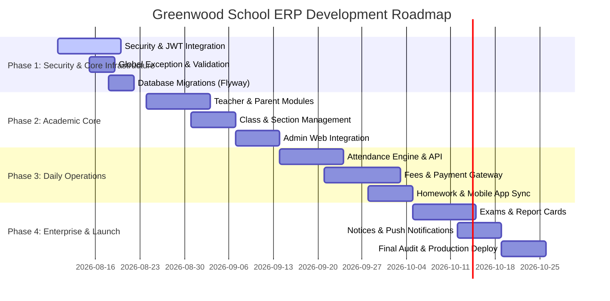

# PROJECT CONTEXT FOR AI ASSISTANTS & ARCHITECTS
> **Document Purpose**: This comprehensive document serves as the single source of truth for future AI assistants (ChatGPT, Gemini, Claude, Antigravity, etc.) and engineering leads. It contains the complete architectural blueprint, codebase state, security analysis, metrics, known issues, and actionable development handover notes for the Greenwood School ERP project. **Reading this document allows any AI or senior engineer to immediately resume development without re-analyzing the codebase.**

---

## 1. Executive Summary

- **Project Name**: Greenwood School ERP (Enterprise Resource Planning System)
- **Root Directory Path**: `w:\ERP`
- **Purpose**: A comprehensive, multi-tenant capable educational enterprise management solution designed to digitize and automate K-12 school operations across administration, student lifecycle management, attendance, fee collection, examinations, parent-teacher communication, and mobile visibility.
- **Business Goals**:
  1. Replace manual registers and fragmented software with a unified cloud-native ERP.
  2. Provide instant real-time visibility to parents and students via a cross-platform mobile app.
  3. Streamline administrative decision-making through automated reporting and analytics.
- **Current Version**: `v0.0.1-SNAPSHOT` (Pre-Alpha / Foundation Setup Phase)
- **Overall Completion Percentage**: **18.5%**
- **Current Development Phase**: **Phase 1 (Security Hardening & Core Infrastructure Setup)**

---

## 2. Technology Stack

| Tier / Component | Technology | Version | Purpose & Description |
| :--- | :--- | :---: | :--- |
| **Backend Framework** | Java / Spring Boot | Java 17 / Spring Boot 4.1.0 | Core REST API backend application (`school-erp`). Uses Spring Starter WebMVC, Spring Data JPA, Spring Security, Spring Starter Validation, Spring Starter Actuator. |
| **Build Tool** | Apache Maven | Maven 3.9+ | Backend dependency management & build system (Includes Maven wrapper `mvnw` / `mvnw.cmd`). |
| **Database Engine** | PostgreSQL | PostgreSQL 14+ | Relational DB storage (`school_erp` database). Configured with Hibernate ORM (`spring.jpa.hibernate.ddl-auto=update`). |
| **Admin Web Frontend** | Next.js / TypeScript | Next.js 15.0 / TS 5.x | Web-based administrative portal (`school-erp-admin`). Uses React 19, Tailwind CSS 3.4, PostCSS, Lucide React Icons (`lucide-react`). |
| **Mobile Application** | Flutter / Dart | Dart 3.x / Flutter SDK | Cross-platform mobile app (`school_erp_mobile`) for iOS, Android, and Web. Uses Material 3 UI design system. |
| **Local Mobile Storage** | `shared_preferences` | v2.5.2 | Local key-value persistence for access tokens, user IDs, and session management. |
| **Mobile HTTP Client** | Dart `http` Package | v1.4.0 | REST API HTTP request client. |
| **Boilerplate Reduction** | Lombok | v1.18.x | Code generation for getters, setters, builders, and constructors in Java. |

---

## 3. Folder Structure & Key Directory Map

```
w:\ERP\
├── backend_Foundation.md               # Architectural specification for backend package organization
├── HELP.md                             # Spring Boot standard help document
├── data-1785050242445.csv              # Initial sample dataset import file
├── PROJECT_CONTEXT_FOR_AI.md           # [THIS FILE] Permanent AI context & audit documentation
│
├── project-report\                     # Technical Audit & Analysis Reports Directory
│   ├── 01_Project_Overview.md
│   ├── 02_Project_Architecture.md
│   ├── 03_Module_Analysis.md
│   ├── 04_Development_Progress.md
│   ├── 05_API_Documentation.md
│   ├── 06_Database_Analysis.md
│   ├── 07_Frontend_Analysis.md
│   ├── 08_Backend_Analysis.md
│   ├── 09_Code_Quality_Report.md
│   ├── 10_Bugs_And_Issues.md
│   ├── 11_Feature_Gap_Report.md
│   ├── 12_Next_Development_Roadmap.md
│   ├── 13_Project_TODO.md
│   ├── 14_Risk_Assessment.md
│   └── 15_Executive_Summary.md
│
├── school-erp\                         # BACKEND: Spring Boot Project
│   ├── pom.xml                         # Maven dependencies & build plugins
│   ├── mvnw / mvnw.cmd                 # Maven wrapper scripts
│   └── src\
│       ├── main\
│       │   ├── java\com\greenwood\school_erp\
│       │   │   ├── SchoolErpApplication.java   # Spring Boot Main Entrypoint
│       │   │   ├── common\response\        # Standard ApiResponse<T> wrapper
│       │   │   ├── config\                 # SecurityConfig & PasswordConfig
│       │   │   └── modules\
│       │   │       ├── admin\              # Admin Login, Service, Controller, Entity
│       │   │       ├── authentication\     # User Login, Service, Controller, Entity
│       │   │       └── students\           # Student CRUD, Service, Controller, Entity
│       │   └── resources\
│       │       ├── application.properties      # Active profile config (`dev`)
│       │       ├── application-dev.properties  # DB PostgreSQL connection string
│       │       └── application-prod.properties # [EMPTY FILE - 0 Bytes]
│       └── test\
│           └── java\com\greenwood\school_erp\SchoolErpApplicationTests.java
│
├── school-erp-admin\                   # FRONTEND: Next.js Web Admin Portal
│   ├── package.json                    # Dependencies (Next.js 15, React 19, Tailwind)
│   ├── tsconfig.json                   # TypeScript configuration
│   ├── next.config.ts                  # Next.js framework configuration
│   ├── components\
│   │   ├── layout\Sidebar.tsx          # Navigation sidebar component
│   │   └── ui\Card.tsx                 # Dashboard metric card component
│   └── app\
│       ├── layout.tsx                  # Root HTML & Geist font layout
│       ├── page.tsx                    # Root landing page / redirect
│       ├── globals.css                 # Tailwind CSS styles
│       └── dashboard\
│           ├── layout.tsx              # Dashboard wrapper layout with Sidebar
│           ├── page.tsx                # Main Dashboard overview page
│           └── students\page.tsx       # Student Management table view (Static Data)
│
└── school_erp_mobile\                  # MOBILE: Flutter Cross-Platform App
    ├── pubspec.yaml                    # Flutter dependencies (http, shared_preferences)
    ├── analysis_options.yaml           # Dart linting rules
    └── lib\
        ├── main.dart                   # Flutter App Entrypoint
        ├── core\                       # Storage, API Client, Themes, Colors, Constants
        │   ├── api\api_client.dart     # HTTP client targeting 10.0.2.2 / localhost:8080
        │   ├── api\api_constants.dart  # API endpoint constants
        │   ├── storage\session_manager.dart # SharedPreferences session manager
        │   └── themes\app_theme.dart   # AppTheme color scheme
        ├── authentication\             # [REDUNDANT LEGACY MODULE] Models & AuthService
        └── features\                   # Feature-first application modules
            ├── attendance\presentation\screens\attendance_screen.dart # Monthly calendar
            ├── auth\presentation\screens\login_screen.dart        # Login UI Screen
            ├── auth\presentation\screens\splash_screen.dart       # Animated Splash
            ├── dashboard\presentation\screens\dashboard_screen.dart # Student Home
            ├── homework\presentation\screens\homework_screen.dart  # Homework UI
            ├── profile\presentation\screens\profile_screen.dart   # Student Profile
            └── settings\presentation\screens\setting_screen.dart  # [EMPTY FILE - 0 Bytes]
```

---

## 4. Architecture Overview

### System Component Interaction Diagram

```mermaid
graph TD
    subgraph Client Tier
        WA[Next.js 15 Web Admin\\nschool-erp-admin]
        MA[Flutter Mobile App\\nschool_erp_mobile]
    end

    subgraph API & Gateway Tier
        CORS[CORS Filter]
        SEC[Spring Security Filter Chain]
        DISP[DispatcherServlet]
    end

    subgraph Backend Application Tier (school-erp)
        AC[AdminController]
        AUC[AuthController]
        SC[StudentController]

        AS[AdminService]
        AUS[AuthService]
        SS[StudentService]

        AR[AdminRepository]
        UR[UserRepository]
        STR[StudentRepository]
    end

    subgraph Data Tier
        DB[(PostgreSQL Database\\nschool_erp)]
    end

    WA -->|HTTP / JSON| CORS
    MA -->|HTTP / JSON| CORS
    CORS --> SEC
    SEC --> DISP
    DISP --> AC
    DISP --> AUC
    DISP --> SC

    AC --> AS
    AUC --> AUS
    SC --> SS

    AS --> AR
    AUS --> UR
    SS --> STR

    AR --> DB
    UR --> DB
    STR --> DB
```

### Detailed Component Flows

1. **Frontend Flow**:
   - **Web Admin**: Next.js App Router renders server components wrapped in `app/dashboard/layout.tsx`. Navigating via `Sidebar.tsx` changes active route without full page reloads.
   - **Mobile App**: `main.dart` initializes `SplashScreen.dart`, which checks `SessionManager` (`SharedPreferences`) for existing tokens. If valid, routes to `BottomNavigation` (Dashboard / Attendance / Homework / Profile); otherwise routes to `LoginScreen.dart`.

2. **Backend & Request Flow**:
   - HTTP Requests enter Spring Boot via Tomcat web container.
   - `SecurityConfig` processes CORS headers (`http://localhost:3000` allowed) and checks path permissions.
   - `DispatcherServlet` dispatches requests to `@RestController` instances (`AuthController`, `AdminController`, `StudentController`).
   - Controllers invoke `@Service` methods containing validation logic.
   - Services execute Spring Data JPA queries against `PostgreSQL` via Hibernate ORM.
   - Output is serialized into DTOs and wrapped in standard `ApiResponse<T>`.

3. **Authentication Flow & Deficiencies**:
   - `POST /api/auth/login` checks email via `UserRepository.findByEmail()` and validates password using `PasswordEncoder.matches()`.
   - **CRITICAL DEFECT**: Neither `AuthService` nor `AdminService` generates or returns a JWT Bearer token upon successful authentication.
   - **CRITICAL DEFECT**: `AdminService.java` compares passwords as unhashed plaintext strings (`!admin.get().getPassword().equals(...)`).

4. **User Roles**:
   - `SUPER_ADMIN` / `ADMIN`: Full administrative control over school operations.
   - `TEACHER`: Class management, attendance marking, homework creation.
   - `PARENT`: Child progress tracking, fee payments, attendance views.
   - `STUDENT`: Timetable viewing, homework submission, exam results.

---

## 5. Implemented Modules Analysis

### Module 1: Authentication & Security
- **Purpose**: User login, role assignment, and access control.
- **Status**: **Incomplete (36.6% Completed)**.
- **Completed Features**: User entity creation, BCrypt password matching for standard users, login API endpoint (`/api/auth/login`), Flutter login screen UI & session manager.
- **Pending Features**: JWT Token generation (`io.jsonwebtoken`), JWT request filter, password reset workflow, role-based access rules.
- **Important Files**:
  - `SecurityConfig.java`, `PasswordConfig.java`, `AuthController.java`, `AuthService.java`, `User.java`, `login_screen.dart`, `session_manager.dart`.

### Module 2: Admin Management
- **Purpose**: System administration and administrative authentication.
- **Status**: **Incomplete (35.0% Completed)**.
- **Completed Features**: `Admin` entity, `AdminRepository`, `AdminController`, `AdminService`, Next.js dashboard shell & sidebar navigation.
- **Pending Features**: BCrypt hashing for admin passwords, super-admin privilege management, system settings control.
- **Important Files**:
  - `AdminController.java`, `AdminService.java`, `Admin.java`, `Sidebar.tsx`, `app/dashboard/page.tsx`.

### Module 3: Student Management
- **Purpose**: Student record tracking, admission processing, and profile management.
- **Status**: **In Progress (46.6% Completed)**.
- **Completed Features**: `Student` entity, unique admission number validation, `createStudent()`, `getAllStudents()`, `getStudentById()`, Next.js student table view UI, Flutter student profile screen UI.
- **Pending Features**: `PUT /api/students/{id}` (Update), `DELETE /api/students/{id}` (Delete), Pagination & Search filtering, Add/Edit Student Modal in Web Admin.
- **Important Files**:
  - `StudentController.java`, `StudentService.java`, `StudentRepository.java`, `Student.java`, `StudentRequest.java`, `StudentResponse.java`, `app/dashboard/students/page.tsx`, `profile_screen.dart`.

### Modules 4 - 19: Unbuilt / Stub-Only Modules (0% - 10% Completed)
- **Attendance Management (10.0%)**: Mobile UI calendar view (`attendance_screen.dart`) exists. Backend entity, controller, and DB schema are **missing**.
- **Homework & Assignments (6.6%)**: Mobile UI list view (`homework_screen.dart`) exists. Backend entity, controller, and DB schema are **missing**.
- **Teacher, Parent, Fees, Exams, Timetable, Transport, Library, Hostel, Payroll, Inventory, Admissions, Notices, Reports, Settings**: **0% Completed** (Unbuilt across backend, web admin, and mobile).

---

## 6. Database Schema & Entity Summary

### Implemented Entities

1. **`User` Entity (`users` table)**:
   - `id` (`BIGINT`, PK, Auto-increment)
   - `email` (`VARCHAR`, UK, NOT NULL)
   - `password` (`VARCHAR`, NOT NULL - BCrypt Hashed)
2. **`Admin` Entity (`admins` table)**:
   - `id` (`BIGINT`, PK, Auto-increment)
   - `email` (`VARCHAR`, UK, NOT NULL)
   - `password` (`VARCHAR`, NOT NULL - Plaintext)
   - `role` (`VARCHAR`, Default `'ADMIN'`)
3. **`Student` Entity (`students` table)**:
   - `id` (`BIGINT`, PK, Auto-increment)
   - `admissionNo` (`VARCHAR`, UK, NOT NULL)
   - `firstName`, `lastName` (`VARCHAR`, NOT NULL)
   - `className`, `section` (`VARCHAR`, NOT NULL)
   - `rollNo` (`INTEGER`), `house` (`VARCHAR`), `dateOfBirth` (`DATE`), `bloodGroup` (`VARCHAR`), `gender` (`VARCHAR`), `nationality` (`VARCHAR`)
   - `parentEmail`, `parentPhone`, `address` (`VARCHAR`)
   - `academicYear` (`VARCHAR`), `isActive` (`BOOLEAN`), `createdAt` (`TIMESTAMP`)

### Database Relationships & Gaps
- **Entity Relationships**: **0 Relationships Configured**. All entities exist as isolated standalone tables.
- **Missing Foreign Keys**: No linkage between `User` and `Student`/`Admin`; `className` and `section` are stored as raw strings rather than referencing normalized `classes` or `sections` tables.
- **Missing Database Tables**:
  - `teachers`, `parents`, `classes`, `sections`, `subjects`, `attendances`, `fees`, `fee_payments`, `exams`, `marks`, `timetables`, `homework`, `notices`.

---

## 7. API Summary (All Implemented Endpoints)

| # | Method | Endpoint Route | Controller Class | Validation | Security Status | Implementation Status |
| :-: | :--- | :--- | :--- | :---: | :---: | :--- |
| 1 | `POST` | `/api/auth/login` | `AuthController` | Missing | `permitAll()` | **Incomplete**: Validates credentials but returns NO JWT token. |
| 2 | `GET` | `/api/auth/users` | `AuthController` | None | Authenticated | **Vulnerability**: Exposes raw `User` entity including hashed passwords. |
| 3 | `GET` | `/api/auth/encrypt-passwords` | `AuthController` | None | Authenticated | **Broken**: Re-hashes already hashed BCrypt passwords on repeated calls. |
| 4 | `POST` | `/api/admin/login` | `AdminController` | Missing | `permitAll()` | **Vulnerability**: Compares passwords as unhashed plaintext strings. |
| 5 | `POST` | `/api/students` | `StudentController` | `@Valid` | `permitAll()` | **Working**: Functionally inserts student; publicly exposed without auth. |
| 6 | `GET` | `/api/students` | `StudentController` | None | `permitAll()` | **Working**: Returns full list of students; lacks pagination. |
| 7 | `GET` | `/api/students/{id}` | `StudentController` | None | `permitAll()` | **Working**: Returns student record by ID. |

---

## 8. Development Progress Matrix

| Module / Component | Category | Status | Backend | Web Admin | Mobile | Progress % |
| :--- | :--- | :--- | :---: | :---: | :---: | :---: |
| **Project Build System** | Setup | Completed | 100% | 100% | 100% | **100.0%** |
| **Authentication & Security** | Security | Incomplete | 50% | 20% | 40% | **36.6%** |
| **Admin Management** | Core | Incomplete | 40% | 30% | N/A | **35.0%** |
| **Student Management** | Core | In Progress | 70% | 40% | 30% | **46.6%** |
| **Attendance Management** | Academic | Stub Only | 0% | 0% | 30% | **10.0%** |
| **Homework Management** | Academic | Stub Only | 0% | 0% | 20% | **6.6%** |
| **Teacher Management** | Core | Not Started | 0% | 0% | 0% | **0.0%** |
| **Parent Management** | Core | Not Started | 0% | 0% | 0% | **0.0%** |
| **Fees & Finance** | Financial | Not Started | 0% | 0% | 0% | **0.0%** |
| **Exams & Grading** | Academic | Not Started | 0% | 0% | 0% | **0.0%** |
| **Timetable & Scheduling** | Operations | Not Started | 0% | 0% | 0% | **0.0%** |
| **Transport Management** | Operations | Not Started | 0% | 0% | 0% | **0.0%** |
| **Library Management** | Operations | Not Started | 0% | 0% | 0% | **0.0%** |
| **Hostel Management** | Operations | Not Started | 0% | 0% | 0% | **0.0%** |
| **Payroll & HR** | Financial | Not Started | 0% | 0% | 0% | **0.0%** |
| **Inventory Management** | Operations | Not Started | 0% | 0% | 0% | **0.0%** |
| **Admissions Workflow** | Admin | Not Started | 0% | 0% | 0% | **0.0%** |
| **Communication & Notices**| Notices | Not Started | 0% | 0% | 0% | **0.0%** |
| **Reports & Analytics** | Reporting | Not Started | 0% | 0% | 0% | **0.0%** |
| **System Settings** | Config | Broken Stub | 0% | 0% | 0% | **0.0%** |

### **Overall Project Completion**: **18.5%**

---

## 9. Pending Tasks Inventory (Prioritized)

### Priority P0: Critical Security & Structural Deficiencies
1. Add `io.jsonwebtoken` (JJWT) to `pom.xml`, implement `JwtTokenProvider`, `JwtAuthenticationFilter`, and enforce JWT validation in `SecurityConfig.java`.
2. Hash admin passwords with BCrypt and fix `AdminService.java` plaintext comparison.
3. Remove `/api/students` from `permitAll()` to prevent unauthenticated public data modifications.
4. Implement `@RestControllerAdvice` in `GlobalExceptionHandler.java` for clean JSON error responses.
5. Fix empty files: Implement `setting_screen.dart` in Flutter and delete or populate `LoginUserResponse.java` (Admin DTO).

### Priority P1: Core Academic & User Modules
1. Complete Student CRUD: Build `PUT /api/students/{id}` and `DELETE /api/students/{id}` with Spring Data `Pageable`.
2. Connect Next.js Admin Student view (`app/dashboard/students/page.tsx`) to live Spring Boot API endpoints.
3. Implement `Teacher` & `Parent` domains across backend entities, repositories, services, controllers, and frontend views.
4. Implement `SchoolClass` and `Section` entities with JPA foreign key relationships.

### Priority P2: Daily Operations & Workflows
1. Build Attendance domain (Entity, bulk submission API, monthly summaries).
2. Build Fees & Finance engine (Fee heads, invoice generation, payment gateway integration).
3. Connect Flutter app views (Attendance, Homework, Profile) to live Spring Boot APIs.

---

## 10. Known Bugs & Issues Register

1. **Security Vulnerability**: `AdminService.java` checks admin passwords in plaintext (`!admin.get().getPassword().equals(...)`).
2. **Security Vulnerability**: `/api/students` endpoints are unauthenticated (`permitAll()`).
3. **Data Leakage**: `/api/auth/users` returns raw `User` entity objects exposing BCrypt password hashes.
4. **Data Corruption**: `/api/auth/encrypt-passwords` double-hashes passwords if invoked multiple times.
5. **Runtime Crash**: `school_erp_mobile/lib/features/settings/presentation/screens/setting_screen.dart` is an empty 0-byte file.
6. **Dead Code**: `school-erp/src/main/java/.../admin/dto/response/LoginUserResponse.java` is an empty 0-byte file.
7. **Missing Config**: `school-erp/src/main/resources/application-prod.properties` is an empty 0-byte file.
8. **Compiler Warnings**: Lombok `@Builder` compiler warnings on `Student.java` and `StudentRequest.java` due to inline initializations without `@Builder.Default`.
9. **Flutter Lints**: `login_screen.dart` uses `BuildContext` across async gaps (`use_build_context_synchronously`).
10. **Flutter Deprecations**: `dashboard_screen.dart` and `profile_screen.dart` use deprecated `.withOpacity()` method.

---

## 11. Development Roadmap



- **Phase 1: Security & Core Infrastructure Setup (Weeks 1 - 2)**
  - Add JJWT dependencies to `pom.xml`, implement JWT Provider/Filter, enforce Spring Security JWT validation, hash admin passwords, add `GlobalExceptionHandler.java`, and set up Flyway migrations.
- **Phase 2: Core Academic & User Modules (Weeks 3 - 5)**
  - Implement Teacher, Parent, Class, and Section domains. Complete Student CRUD with pagination. Connect Next.js Admin frontend to live APIs using React Query.
- **Phase 3: Daily Operational Modules (Weeks 6 - 9)**
  - Build Attendance, Fees & Finance, and Homework modules. Connect Flutter mobile app to live APIs.
- **Phase 4: Advanced Modules & Production Launch (Weeks 10 - 13)**
  - Build Examinations & Report Cards, Noticeboard with Firebase Push Notifications, Reports/Analytics, and deploy with Docker containers.

---

## 12. AI Handover & Developer Notes

> **ATTENTION FUTURE AI ASSISTANTS**: Read the following rules and instructions carefully before writing or editing any code in this repository.

### A. How the Project is Organized
- **3 Independent Repositories**:
  1. `school-erp`: Spring Boot Java backend. Main package: `com.greenwood.school_erp`.
  2. `school-erp-admin`: Next.js 15 Web Admin app using TypeScript and App Router (`app/`).
  3. `school_erp_mobile`: Flutter cross-platform mobile app under `lib/`.
- **Domain-Driven Modular Backend Package Structure**:
  - Keep domain components under `com.greenwood.school_erp.modules.<module_name>` containing `controller`, `service`, `repository`, `entity`, and `dto` sub-packages.

### B. Coding Conventions & Requirements
1. **Java / Spring Boot**:
   - Use `@RequiredArgsConstructor` for constructor injection rather than `@Autowired` on private fields.
   - Always wrap controller response payloads in `ApiResponse<T>`.
   - When using Lombok `@Builder` on entities with default field values, ALWAYS annotate the fields with `@Builder.Default`.
   - Do NOT expose JPA `@Entity` classes directly in `@RestController` endpoints; map to/from DTOs (`Request` / `Response`).
2. **Next.js Web Admin**:
   - Use App Router convention (`app/dashboard/.../page.tsx`).
   - Keep reusable UI widgets under `components/ui/` and layouts under `components/layout/`.
   - Use Tailwind CSS utility classes; avoid inline styles.
3. **Flutter Mobile App**:
   - Follow feature-first organization under `lib/features/<feature_name>/presentation/screens/`.
   - **DO NOT** add new code to `lib/authentication/` (this is a legacy directory slated for deletion). Consolidate all auth views into `lib/features/auth/`.
   - Use `if (!mounted) return;` before using `BuildContext` after async gaps.
   - Use `.withValues()` instead of deprecated `.withOpacity()`.

### C. Critical Command & Tool Execution Guidelines
- **Windows PowerShell Environment**:
  - Do NOT run `mvn` directly; use `.\\mvnw.cmd` inside `school-erp`.
  - In PowerShell, separate multiple terminal commands using `;` (semicolon), NOT `&&`.
  - When running static checks:
    - Backend: `.\\mvnw.cmd test-compile` (in `school-erp`)
    - Web Admin: `npx tsc --noEmit` (in `school-erp-admin`)
    - Mobile App: `dart analyze` (in `school_erp_mobile`)

### D. Critical Files Reference List
- Backend Main Entrypoint: [`SchoolErpApplication.java`](file:///w:/ERP/school-erp/src/main/java/com/greenwood/school_erp/SchoolErpApplication.java)
- Backend Security Config: [`SecurityConfig.java`](file:///w:/ERP/school-erp/src/main/java/com/greenwood/school_erp/config/SecurityConfig.java)
- Backend Foundation Blueprint: [`backend_Foundation.md`](file:///w:/ERP/backend_Foundation.md)
- Web Admin Sidebar Component: [`Sidebar.tsx`](file:///w:/ERP/school-erp-admin/components/layout/Sidebar.tsx)
- Web Admin Student Page: [`page.tsx`](file:///w:/ERP/school-erp-admin/app/dashboard/students/page.tsx)
- Mobile App Main Entrypoint: [`main.dart`](file:///w:/ERP/school_erp_mobile/lib/main.dart)
- Mobile Session Manager: [`session_manager.dart`](file:///w:/ERP/school_erp_mobile/lib/core/storage/session_manager.dart)
- Mobile API Client: [`api_client.dart`](file:///w:/ERP/school_erp_mobile/lib/core/api/api_client.dart)

---

## 13. System Metrics Summary

| Metric Name | Quantitative Value | Metric Notes |
| :--- | :---: | :--- |
| **Total Non-Ignored Files** | **280 Files** | 62 Backend, 25 Admin Web, 193 Mobile |
| **Hand-written Source Files** | **58 Files** | 26 Java, 9 TSX/TS, 23 Dart |
| **Total Lines of Code (LOC)** | **33,173 Lines** | Total file content lines across repositories |
| **Core Source LOC** | **~3,250 Lines** | ~1,100 Java, ~450 TSX, ~1,700 Dart |
| **Total Functional Modules** | **19 Modules** | 3 partially implemented, 16 pending |
| **Database Entities** | **3 Entities** | `User`, `Admin`, `Student` |
| **Spring Controllers** | **3 Controllers** | `AuthController`, `AdminController`, `StudentController` |
| **Spring Services** | **3 Services** | `AuthService`, `AdminService`, `StudentService` |
| **Spring Repositories** | **3 Repositories** | `UserRepository`, `AdminRepository`, `StudentRepository` |
| **React Components** | **2 Components** | `Sidebar.tsx`, `Card.tsx` |
| **Next.js Pages** | **3 Pages** | Landing (`/`), Dashboard (`/dashboard`), Students (`/dashboard/students`) |
| **Flutter Screens** | **8 Screens** | 7 active screens, 1 empty (`setting_screen.dart`) |
| **Implemented REST APIs** | **7 Endpoints** | 4 Authentication/Admin, 3 Student |

---

## 14. Final Technical Audit Conclusion

### Overall Project Health Score: **42 / 100**
- **Architecture Readiness**: 65% (Clean separation of frontend and backend, clean package design)
- **Security Readiness**: 15% (Critical plaintext passwords, missing JWT, exposed password hashes)
- **Feature Completion**: 18.5% (Only initial Auth & Student CRUD exist)
- **Code Quality & Build Integrity**: 70% (Backend and Next.js compile cleanly; minor Flutter lints)

### Summary Statement & Next Steps
The Greenwood School ERP project possesses a solid architectural foundation with a modern technology stack (Spring Boot 4.1, Next.js 15, Flutter 3.x). However, it is currently in pre-alpha foundation stage with critical security vulnerabilities (plaintext admin password checks, missing JWT validation, public student endpoint exposure) that must be addressed immediately during **Phase 1** before expanding to additional modules.

- **Estimated Overall Completion**: **18.5%**
- **Estimated Remaining Work**: **81.5%**
- **Estimated Developer Effort Required**: **13 Weeks (520 Developer Hours)**
- **Immediate Action Item**: Implement Phase 1 Security Hardening (JWT Integration, Admin BCrypt Hashing, Global Exception Handler, Flyway Migrations).
