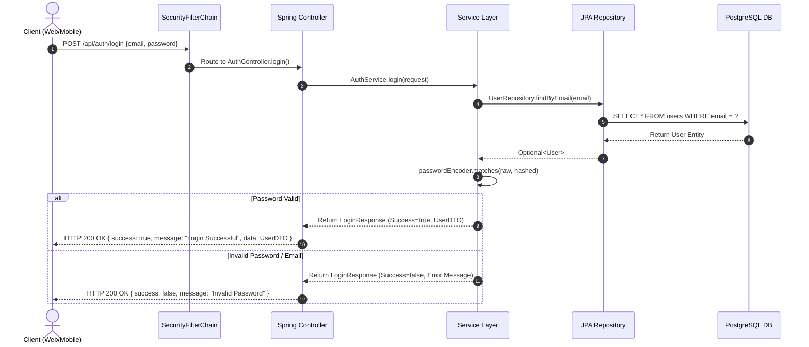

# 02. Project Architecture

## 1. High-Level System Architecture

The Greenwood School ERP application is structured as a **3-Tier Monolithic System with Multi-Client Frontends**.

```mermaid
graph TD
    subgraph Client Tier
        WA[Next.js 15 Web Admin\nschool-erp-admin]
        MA[Flutter Mobile App\nschool_erp_mobile]
    end

    subgraph API & Gateway Tier
        CORS[CORS Filter]
        SEC[Spring Security Filter Chain]
        DISP[DispatcherServlet]
    end

    subgraph Backend Application Tier (school-erp)
        AC[AdminController]
        AUC[AuthController]
        SC[StudentController]

        AS[AdminService]
        AUS[AuthService]
        SS[StudentService]

        AR[AdminRepository]
        UR[UserRepository]
        STR[StudentRepository]
    end

    subgraph Data Tier
        DB[(PostgreSQL Database\nschool_erp)]
    end

    WA -->|HTTP / JSON| CORS
    MA -->|HTTP / JSON| CORS
    CORS --> SEC
    SEC --> DISP
    DISP --> AC
    DISP --> AUC
    DISP --> SC

    AC --> AS
    AUC --> AUS
    SC --> SS

    AS --> AR
    AUS --> UR
    SS --> STR

    AR --> DB
    UR --> DB
    STR --> DB
```

---

## 2. Tier-by-Tier Architectural Breakdown

### A. Frontend Web Admin Architecture (`school-erp-admin`)
- **Pattern**: Next.js 15 App Router Architecture.
- **Routing**: File-system based routing (`app/dashboard/students/page.tsx`).
- **Layout System**: Root layout (`app/layout.tsx`) wrapping nested dashboard layout (`app/dashboard/layout.tsx`) containing persistent `Sidebar.tsx`.
- **Component Hierarchy**:
  - Pages (Server / Client Components)
  - Layout Components (`Sidebar.tsx`)
  - UI Primitive Components (`Card.tsx`)

### B. Mobile App Architecture (`school_erp_mobile`)
- **Pattern**: Feature-First Layered Architecture.
- **Directories**:
  - `lib/core/`: Application themes, colors, API client, local storage managers.
  - `lib/features/`: Feature modules (`auth`, `dashboard`, `attendance`, `homework`, `profile`, `settings`).
  - `lib/authentication/`: **Legacy / Redundant** authentication directory (Models & Service).

### C. Backend Application Architecture (`school-erp`)
- **Pattern**: Layered Monolithic Architecture organized by domain modules.
- **Package Hierarchy**:
  - `com.greenwood.school_erp.config`: Centralized Spring configuration beans (`SecurityConfig`, `PasswordConfig`).
  - `com.greenwood.school_erp.common`: Shared response wrappers (`ApiResponse<T>`).
  - `com.greenwood.school_erp.modules.<domain>`: Domain-isolated modules containing `controller`, `service`, `repository`, `entity`, `dto` (request/response).

---

## 3. Authentication & Request Lifecycle



### Architectural Deficiencies in Request Lifecycle:
1. **Missing JWT Token Generation**: Login endpoints return basic success flags without JWT bearer tokens.
2. **Missing Security Interceptor**: Subsequent requests to authenticated endpoints are NOT verified by a JWT filter.
3. **Inconsistent Endpoint Authorization**: `/api/students` endpoints are marked `permitAll()`, leaving all student data completely unauthenticated.

---

## 4. Design Patterns Implemented

1. **Repository Pattern**: Spring Data JPA interfaces (`UserRepository`, `StudentRepository`, `AdminRepository`) abstracting DB SQL execution.
2. **DTO (Data Transfer Object) Pattern**: Decoupling database entities from API request/response payloads (`StudentRequest`, `StudentResponse`).
3. **Service Layer Pattern**: Encapsulating business logic in `@Service` classes (`StudentService`, `AuthService`).
4. **Builder Pattern**: Using Lombok `@Builder` for immutability and readable object construction (`Student.builder()...`).
5. **Dependency Injection Pattern**: Spring `@Autowired` and `@RequiredArgsConstructor` constructor injection.
