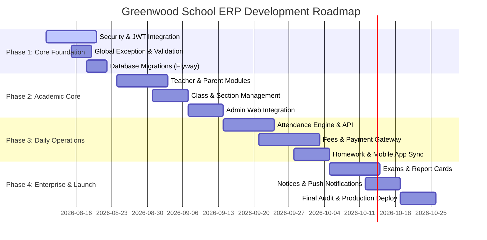

# 12. Next Development Roadmap

## Phased Execution Strategy (13-Week Timeline)

---

## Detailed Phase Breakdown

### Phase 1: Security & Core Infrastructure (Weeks 1 - 2)
- **Primary Objectives**: Secure backend APIs, implement JWT authentication, eliminate plaintext credentials, add global exception handling, and set up database migrations.
- **Tasks**:
  1. Add `io.jsonwebtoken` (JJWT) dependency to `pom.xml`.
  2. Implement `JwtTokenProvider`, `JwtAuthenticationFilter`, and `CustomUserDetailsService`.
  3. Hash admin passwords with BCrypt and fix `AdminService.java`.
  4. Implement `GlobalExceptionHandler.java` handling `ResourceNotFoundException`, `MethodArgumentNotValidException`, and `BadRequestException`.
  5. Delete empty files (`setting_screen.dart`, `LoginUserResponse.java` in admin DTO).
  6. Add Flyway migration scripts under `src/main/resources/db/migration/`.
- **Dependencies**: Spring Security, JJWT, Flyway.
- **Difficulty**: Medium | **Estimated Effort**: 2 Weeks (80 Hours).

### Phase 2: Core Academic & User Modules (Weeks 3 - 5)
- **Primary Objectives**: Implement Teacher, Parent, Class, and Section domains across backend, web admin, and mobile.
- **Tasks**:
  1. Create `Teacher`, `Parent`, `SchoolClass`, and `Section` entities with JPA relations.
  2. Implement complete CRUD APIs with pagination (`Pageable`).
  3. Build Next.js Admin views for Teachers, Parents, and Class allocation.
  4. Connect Next.js frontend to Spring Boot backend APIs using React Query / SWR.
- **Dependencies**: Phase 1 Security.
- **Difficulty**: Medium | **Estimated Effort**: 3 Weeks (120 Hours).

### Phase 3: Daily Operational Modules (Weeks 6 - 9)
- **Primary Objectives**: Implement Attendance, Fees & Finance, and Homework systems.
- **Tasks**:
  1. Build Attendance domain (`Attendance` entity, bulk attendance submission API, monthly summaries).
  2. Implement Fee Structure, Fee Discount, Invoice, and Stripe/Razorpay payment gateway integration.
  3. Complete Flutter Attendance & Homework integration.
- **Dependencies**: Phase 2 User Modules.
- **Difficulty**: High | **Estimated Effort**: 4 Weeks (160 Hours).

### Phase 4: Enterprise Modules, Reports & Deployment (Weeks 10 - 13)
- **Primary Objectives**: Implement Examinations, Noticeboard/Push Notifications, Transport/Library, Analytics, and Production CI/CD deployment.
- **Tasks**:
  1. Build Exam Gradebook, GPA calculator, and PDF Report Card generator.
  2. Integrate Firebase Cloud Messaging (FCM) for push notifications on mobile.
  3. Setup Docker containers (`Dockerfile`, `docker-compose.yml`) for PostgreSQL, Spring Boot backend, and Next.js frontend.
- **Dependencies**: Phase 3 Operations.
- **Difficulty**: High | **Estimated Effort**: 4 Weeks (160 Hours).
